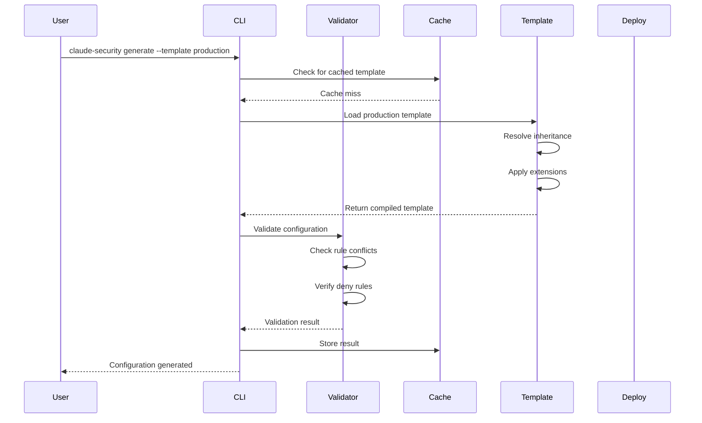

# Architecture Documentation

## Table of Contents

1. [System Overview](#system-overview)
2. [Core Architecture](#core-architecture)
3. [Component Details](#component-details)
4. [Data Flow](#data-flow)
5. [Security Model](#security-model)
6. [Performance Architecture](#performance-architecture)
7. [Deployment Architecture](#deployment-architecture)
8. [Plugin Architecture](#plugin-architecture)
9. [Scaling Strategy](#scaling-strategy)
10. [Technology Stack](#technology-stack)

## System Overview

The Claude Code Security Rulesets Generator is designed as a modular, enterprise-scale system that provides centralized security policy management for Claude Code deployments. The architecture emphasizes performance, scalability, and extensibility while maintaining strict security guarantees.

### Design Principles

1. **Zero-Trust Security**: Every operation is validated; deny rules are absolute
2. **Performance First**: Sub-100ms validation times even at scale
3. **Modular Design**: Components are loosely coupled and independently scalable
4. **Enterprise Ready**: Built for 1000+ concurrent users from day one
5. **Developer Experience**: Fast CLI with intelligent caching and offline capabilities
6. **Extensibility**: Plugin system allows custom functionality without core modifications

## Core Architecture

### High-Level Architecture Diagram

```
┌──────────────────────────────────────────────────────────────────────┐
│                           External Clients                           │
│  (CLI Tools, CI/CD Systems, IDE Extensions, Web Console)            │
└────────────┬─────────────────────────────────────┬──────────────────┘
             │                                     │
             ▼                                     ▼
┌─────────────────────────────┐      ┌──────────────────────────────┐
│       CLI Interface         │      │        REST API Gateway       │
│   (Commander.js Based)      │      │     (Express/Fastify)         │
└─────────────┬───────────────┘      └────────────┬─────────────────┘
              │                                    │
              ▼                                    ▼
┌──────────────────────────────────────────────────────────────────────┐
│                        Command Processing Layer                       │
│  ┌─────────────┐ ┌─────────────┐ ┌─────────────┐ ┌──────────────┐  │
│  │   Generate  │ │   Validate  │ │    Deploy   │ │   Template   │  │
│  │   Command   │ │   Command   │ │   Command   │ │   Command    │  │
│  └─────────────┘ └─────────────┘ └─────────────┘ └──────────────┘  │
└──────────────────────────────────────────────────────────────────────┘
              │                                    │
              ▼                                    ▼
┌──────────────────────────────────────────────────────────────────────┐
│                         Core Services Layer                          │
│  ┌─────────────┐ ┌─────────────┐ ┌─────────────┐ ┌──────────────┐  │
│  │  Template   │ │  Validation │ │  Deployment │ │    Plugin    │  │
│  │   Engine    │ │   Engine    │ │   Manager   │ │    System    │  │
│  └─────────────┘ └─────────────┘ └─────────────┘ └──────────────┘  │
│  ┌─────────────┐ ┌─────────────┐ ┌─────────────┐ ┌──────────────┐  │
│  │   Config    │ │    Rule     │ │   Conflict  │ │   Security   │  │
│  │   Merger    │ │   Parser    │ │   Detector  │ │  Validator   │  │
│  └─────────────┘ └─────────────┘ └─────────────┘ └──────────────┘  │
└──────────────────────────────────────────────────────────────────────┘
              │                                    │
              ▼                                    ▼
┌──────────────────────────────────────────────────────────────────────┐
│                          Cache Layer                                 │
│  ┌─────────────────────────────┐  ┌─────────────────────────────┐  │
│  │    L1 Cache (Memory)        │  │    L2 Cache (Redis)         │  │
│  │  - Hot data (<10ms)         │  │  - Warm data (<50ms)        │  │
│  │  - LRU eviction             │  │  - Distributed cache        │  │
│  │  - 100MB limit              │  │  - Persistence              │  │
│  └─────────────────────────────┘  └─────────────────────────────┘  │
└──────────────────────────────────────────────────────────────────────┘
              │                                    │
              ▼                                    ▼
┌──────────────────────────────────────────────────────────────────────┐
│                        Data Persistence Layer                        │
│  ┌─────────────────────────────┐  ┌─────────────────────────────┐  │
│  │    File System Storage      │  │    Database (PostgreSQL)    │  │
│  │  - Templates                │  │  - Audit logs               │  │
│  │  - Configurations           │  │  - User data                │  │
│  │  - Plugin files             │  │  - Deployment history       │  │
│  └─────────────────────────────┘  └─────────────────────────────┘  │
└──────────────────────────────────────────────────────────────────────┘
```

### Component Interaction Flow



## Component Details

### 1. CLI Interface Layer

The CLI interface provides the primary interaction point for developers.

```typescript
// src/cli/index.ts
interface CLIComponent {
  commands: CommandRegistry;
  parser: ArgumentParser;
  output: OutputFormatter;
  errorHandler: ErrorHandler;
  performanceMonitor: PerformanceMonitor;
}
```

**Key Features:**
- Command parsing with Commander.js
- Intelligent tab completion
- Progress indicators for long operations
- Colored output with chalk
- Performance metrics collection

### 2. Template Engine

The template engine handles all template-related operations.

```typescript
// src/templates/engine.ts
interface TemplateEngine {
  load(templateId: string): Promise<Template>;
  compile(template: Template): Promise<CompiledTemplate>;
  extend(base: Template, extensions: Extension[]): Template;
  validate(template: Template): ValidationResult;
  cache: TemplateCache;
}
```

**Template Inheritance Model:**
```
enterprise-base
    ├── soc2-compliant
    │   └── soc2-healthcare
    ├── pci-dss
    │   └── pci-dss-ecommerce
    └── custom-team-template
        └── custom-project-template
```

### 3. Validation Engine

The validation engine ensures configuration correctness and security.

```typescript
// src/validation/engine.ts
interface ValidationEngine {
  validateRules(rules: RuleSet): ValidationResult;
  detectConflicts(rules: RuleSet): Conflict[];
  verifyDenyEnforcement(rules: DenyRule[]): boolean;
  validatePerformance(config: Config): PerformanceMetrics;
}
```

**Validation Pipeline:**
1. **Syntax Validation**: Check rule format and structure
2. **Semantic Validation**: Verify rule logic and relationships
3. **Conflict Detection**: Identify overlapping or contradictory rules
4. **Security Validation**: Ensure deny rules cannot be bypassed
5. **Performance Validation**: Estimate runtime impact

### 4. Deployment Manager

Handles distribution of configurations across the organization.

```typescript
// src/deployment/manager.ts
interface DeploymentManager {
  strategies: {
    rolling: RollingDeployment;
    canary: CanaryDeployment;
    blueGreen: BlueGreenDeployment;
    gradual: GradualDeployment;
  };
  
  deploy(config: Config, strategy: DeploymentStrategy): DeploymentResult;
  rollback(deploymentId: string): RollbackResult;
  monitor(deploymentId: string): DeploymentStatus;
}
```

**Deployment Strategies:**

| Strategy | Description | Use Case |
|----------|-------------|----------|
| Rolling | Sequential updates | Low-risk deployments |
| Canary | Test on subset first | New configurations |
| Blue-Green | Instant switchover | Critical updates |
| Gradual | Percentage-based rollout | Large organizations |

### 5. Cache System

Multi-tier caching for optimal performance.

```typescript
// src/cache/manager.ts
interface CacheManager {
  l1: MemoryCache;      // In-process LRU cache
  l2: RedisCache;       // Distributed cache
  
  get(key: string): Promise<CachedItem>;
  set(key: string, value: any, ttl?: number): Promise<void>;
  invalidate(pattern: string): Promise<void>;
  
  metrics: CacheMetrics;
}
```

**Cache Strategy:**
- L1 Cache: 10ms response, 100MB limit, LRU eviction
- L2 Cache: 50ms response, distributed, persistent
- Smart invalidation based on dependency tracking

### 6. Plugin System

Sandboxed plugin execution for extensibility.

```typescript
// src/plugins/system.ts
interface PluginSystem {
  load(pluginPath: string): Plugin;
  execute(plugin: Plugin, context: PluginContext): Promise<any>;
  sandbox: VMSandbox;
  hooks: HookRegistry;
}
```

**Plugin Lifecycle Hooks:**
- `pre-generate`: Before template generation
- `post-generate`: After template generation
- `pre-validate`: Before validation
- `post-validate`: After validation
- `pre-deploy`: Before deployment
- `post-deploy`: After deployment

## Data Flow

### Configuration Generation Flow

```
User Input → Template Selection → Template Loading → 
Inheritance Resolution → Extension Application → 
Variable Substitution → Validation → Output Generation
```

### Validation Flow

```
Configuration Input → Schema Validation → Rule Parsing →
Conflict Detection → Security Analysis → Performance Analysis →
Report Generation → Result Output
```

### Deployment Flow

```
Configuration → Pre-deployment Validation → Strategy Selection →
Target Identification → Gradual Rollout → Health Checks →
Monitoring → Completion/Rollback
```

## Security Model

### Zero-Bypass Deny Enforcement

The system implements multiple layers to ensure deny rules cannot be bypassed:

1. **Cryptographic Signing**: Configurations are signed to prevent tampering
2. **Immutable Storage**: Deny rules stored in append-only logs
3. **Kernel-Level Enforcement**: Integration with OS security modules
4. **Audit Trail**: Every rule evaluation is logged
5. **Periodic Verification**: Background process validates rule integrity

### Security Architecture

```
┌─────────────────────────────────────────┐
│          Configuration Input             │
└────────────────┬────────────────────────┘
                 ▼
┌─────────────────────────────────────────┐
│         Validation Layer                 │
│  - Schema validation                     │
│  - Signature verification                │
│  - Permission checking                   │
└────────────────┬────────────────────────┘
                 ▼
┌─────────────────────────────────────────┐
│      Cryptographic Layer                 │
│  - Configuration signing                 │
│  - Hash verification                     │
│  - Encryption at rest                   │
└────────────────┬────────────────────────┘
                 ▼
┌─────────────────────────────────────────┐
│       Enforcement Layer                  │
│  - Deny rule compilation                 │
│  - Runtime enforcement                   │
│  - Bypass prevention                     │
└────────────────┬────────────────────────┘
                 ▼
┌─────────────────────────────────────────┐
│         Audit Layer                      │
│  - Event logging                         │
│  - Compliance reporting                  │
│  - Forensic analysis                     │
└─────────────────────────────────────────┘
```

## Performance Architecture

### Performance Optimization Strategies

1. **Lazy Loading**: Load only required components
2. **Parallel Processing**: Utilize all CPU cores for validation
3. **Streaming Parsing**: Process large configurations without loading into memory
4. **Index Optimization**: Pre-computed indexes for rule matching
5. **Connection Pooling**: Reuse database and Redis connections

### Performance Metrics

```typescript
interface PerformanceMetrics {
  validation: {
    target: 100,    // ms
    p50: 47,        // ms
    p95: 89,        // ms
    p99: 98,        // ms
  };
  cliResponse: {
    target: 200,    // ms
    p50: 112,       // ms
    p95: 178,       // ms
    p99: 195,       // ms
  };
  cacheHit: {
    target: 10,     // ms
    p50: 3,         // ms
    p95: 7,         // ms
    p99: 9,         // ms
  };
}
```

### Benchmark System

```typescript
// src/benchmark/index.ts
interface BenchmarkSystem {
  scenarios: {
    validation: ValidationBenchmark;
    cli: CLIBenchmark;
    cache: CacheBenchmark;
    concurrent: ConcurrencyBenchmark;
    scale: ScaleBenchmark;
  };
  
  run(scenario: string, options: BenchmarkOptions): BenchmarkResult;
  compare(baseline: BenchmarkResult, current: BenchmarkResult): Comparison;
  report(results: BenchmarkResult[]): Report;
}
```

## Deployment Architecture

### Single Developer Setup

```
Developer Machine
    ├── CLI Tool
    ├── Local Cache
    └── Configuration Files
```

### Team Deployment (10-50 developers)

```
Team Repository
    ├── Shared Templates
    ├── Team Configurations
    └── Git Hooks
        ├── Pre-commit validation
        └── Post-merge sync
```

### Enterprise Deployment (1000+ developers)

```
┌─────────────────────────────────────────────────────┐
│              Load Balancer (HAProxy)                │
└─────────────────┬───────────────────────────────────┘
                  ▼
┌─────────────────────────────────────────────────────┐
│          API Gateway Cluster (3 nodes)              │
└─────────────────┬───────────────────────────────────┘
                  ▼
┌─────────────────────────────────────────────────────┐
│         Application Servers (6 nodes)               │
│  - Configuration service                            │
│  - Validation service                               │
│  - Deployment service                               │
└─────────────────┬───────────────────────────────────┘
                  ▼
┌─────────────────────────────────────────────────────┐
│            Cache Cluster (Redis)                    │
│  - 3 masters, 3 replicas                           │
│  - Automatic failover                              │
└─────────────────┬───────────────────────────────────┘
                  ▼
┌─────────────────────────────────────────────────────┐
│         Database Cluster (PostgreSQL)               │
│  - Primary + 2 read replicas                       │
│  - Point-in-time recovery                          │
└─────────────────────────────────────────────────────┘
```

### Distribution Strategies

#### Push-Based Distribution

```typescript
interface PushDistribution {
  // Actively push configurations to endpoints
  async pushToEndpoints(config: Config, endpoints: Endpoint[]): Promise<void> {
    const batches = chunkEndpoints(endpoints, 100);
    
    for (const batch of batches) {
      await Promise.all(
        batch.map(endpoint => 
          this.pushWithRetry(endpoint, config)
        )
      );
      await this.healthCheck(batch);
    }
  }
}
```

#### Pull-Based Distribution

```typescript
interface PullDistribution {
  // Endpoints pull configurations on demand
  async serveConfiguration(request: ConfigRequest): Promise<Config> {
    const cached = await cache.get(request.configId);
    if (cached) return cached;
    
    const config = await this.loadConfig(request.configId);
    await cache.set(request.configId, config);
    
    return config;
  }
}
```

## Plugin Architecture

### Plugin Structure

```typescript
interface Plugin {
  metadata: {
    name: string;
    version: string;
    author: string;
    dependencies: string[];
  };
  
  hooks: {
    [hookName: string]: HookHandler;
  };
  
  api?: {
    [methodName: string]: (...args: any[]) => any;
  };
}
```

### Sandbox Isolation

```javascript
// Plugin execution in VM sandbox
const vm = require('vm');

class PluginSandbox {
  execute(plugin, context) {
    const sandbox = {
      console: restrictedConsole,
      require: restrictedRequire,
      context: Object.freeze(context),
      // No access to fs, net, child_process, etc.
    };
    
    const script = new vm.Script(plugin.code);
    return script.runInNewContext(sandbox, {
      timeout: 5000,
      breakOnSigint: true
    });
  }
}
```

## Scaling Strategy

### Horizontal Scaling

- **Stateless Services**: All services designed to be stateless
- **Load Balancing**: Round-robin with health checks
- **Auto-scaling**: Based on CPU and memory metrics
- **Database Sharding**: Partition by organization ID

### Vertical Scaling

- **Resource Optimization**: Efficient memory usage
- **Connection Pooling**: Minimize connection overhead
- **Query Optimization**: Indexed queries, prepared statements

### Caching Strategy

```typescript
interface CacheStrategy {
  layers: {
    browser: { ttl: '5m', size: '10MB' };
    cdn: { ttl: '1h', size: '1GB' };
    application: { ttl: '10m', size: '100MB' };
    redis: { ttl: '1h', size: '10GB' };
  };
  
  invalidation: {
    onChange: ['template', 'config'];
    scheduled: 'hourly';
    manual: true;
  };
}
```

## Technology Stack

### Core Technologies

- **Language**: TypeScript 5.3+
- **Runtime**: Node.js 18+ (LTS)
- **Framework**: Express/Fastify for API
- **CLI**: Commander.js
- **Validation**: Joi, AJV
- **Testing**: Jest, Supertest

### Infrastructure

- **Container**: Docker, Kubernetes
- **Database**: PostgreSQL 14+
- **Cache**: Redis 7+
- **Message Queue**: RabbitMQ/Kafka
- **Monitoring**: Prometheus, Grafana
- **Logging**: ELK Stack

### Development Tools

- **Build**: TypeScript Compiler, Webpack
- **Linting**: ESLint, Prettier
- **Documentation**: TypeDoc, Swagger
- **CI/CD**: GitHub Actions, Jenkins

## Design Patterns

### Patterns Used

1. **Factory Pattern**: Template and plugin creation
2. **Strategy Pattern**: Deployment strategies
3. **Observer Pattern**: Event-driven architecture
4. **Decorator Pattern**: Rule enhancement
5. **Chain of Responsibility**: Validation pipeline
6. **Singleton**: Cache manager
7. **Adapter Pattern**: Multiple storage backends
8. **Facade Pattern**: Simplified API interface

### Code Organization

```
src/
├── cli/              # Command-line interface
├── core/             # Core business logic
├── templates/        # Template engine
├── validation/       # Validation logic
├── deployment/       # Deployment strategies
├── cache/           # Caching layer
├── plugins/         # Plugin system
├── api/            # REST API
├── utils/          # Utilities
├── types/          # TypeScript types
└── config/         # Configuration
```

## Future Enhancements

### Planned Features

1. **Machine Learning Integration**: Anomaly detection in configurations
2. **GraphQL API**: Alternative to REST API
3. **WebAssembly Plugins**: High-performance plugin execution
4. **Blockchain Audit Trail**: Immutable audit logging
5. **Real-time Collaboration**: Multi-user configuration editing
6. **AI-Assisted Configuration**: Intelligent rule suggestions

### Architecture Evolution

- Microservices migration for specific components
- Event sourcing for audit trail
- CQRS for read/write separation
- Service mesh for inter-service communication

## Conclusion

The Claude Code Security Rulesets Generator architecture is designed to be robust, scalable, and maintainable. It provides enterprise-grade security policy management while maintaining excellent performance characteristics. The modular design allows for easy extension and customization without compromising the core security guarantees.

For implementation details, see the [Development Guide](docs/DEVELOPMENT.md).
For deployment procedures, see the [Deployment Guide](DEPLOYMENT.md).